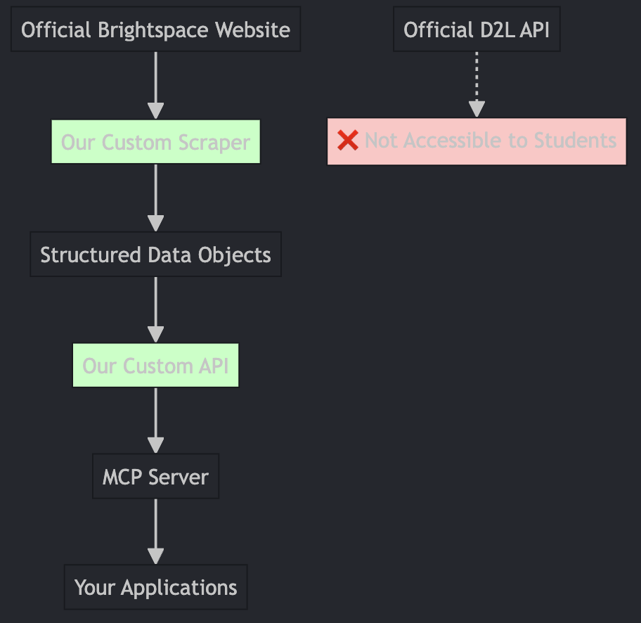

# Brightspace MCP Server
I'm building a Model Context Protocol (MCP) server for Purdue University students to connect and access their Brightspace accounts.

## Overview

I'm using Playwright for web scraping to access Brightspace data since direct API access is not available to students. My implementation handles Duo Mobile 2FA authentication and extracts course information, assignments, and other academic data.

## Quick Start

### 1. Setup Environment
```bash
# Run the setup script (creates virtual environment and installs dependencies)
python setup.py

# Activate the virtual environment
# On macOS/Linux:
source venv/bin/activate
# On Windows:
venv\Scripts\activate
```

### 2. Configure Credentials
Edit the `.env` file with your Purdue credentials:
```
PURDUE_USERNAME=your_purdue_username
PURDUE_PASSWORD=your_purdue_password
```

### 3. Test Connection
```bash
# Test basic connectivity
python testing/playwright_trial.py

# Run the full scraper
python brightspace_api.py
```

## Project Structure

- **`brightspace_api.py`** - Main scraper class with login and data extraction
- **`testing/playwright_trial.py`** - Simple connectivity test
- **`setup.py`** - Automated setup script for virtual environment and dependencies
- **`requirements.txt`** - Python dependencies
- **`.env`** - Environment variables (credentials)

## Features

- ✅ Duo Mobile 2FA authentication handling
- ✅ Course list extraction
- ✅ Assignment data scraping
- ✅ JSON data export
- ✅ Error handling and retry logic
- ✅ Virtual environment isolation

## Why Playwright over API?

- ❌ **D2L Brightspace API**: Requires administrative access, not available to students
- ✅ **Playwright Web Scraping**: Handles 2FA, works with student accounts, more flexible

### Architecture Overview

The diagram below illustrates the roadblock I face with the official D2L API versus my custom implementation:



**The Challenge:** I cannot access the official D2L Brightspace API due to institutional restrictions and administrative requirements.

**My Solution:** I bypass these limitations by creating my own custom API using Playwright web scraping. My approach:
- Mimics human browser interactions
- Handles complex authentication flows (including Duo Mobile 2FA)
- Extracts the same data I see in my browser
- Provides a clean, programmatic interface for my MCP server

## Important Notes

- I always respect Purdue's terms of service
- I use reasonable scraping intervals
- I keep my credentials secure (never commit to git)
- The CSS selectors may need updates based on Brightspace interface changes